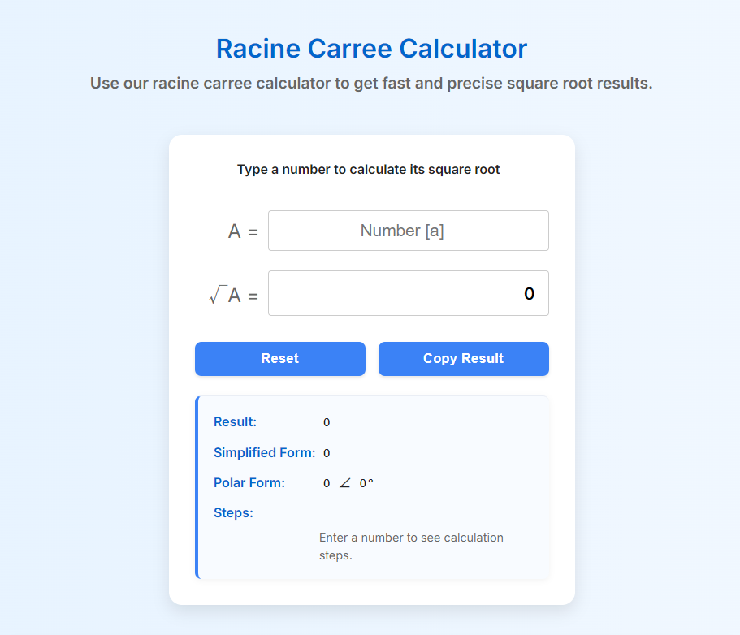

# 📐 Racine Carrée Calculator – Outil de Racine Carrée en Ligne

> 🧮 Calculez rapidement la racine carrée de n'importe quel nombre  
> 🌍 Conçu pour les étudiants, enseignants, ingénieurs et curieux des mathématiques

🔗 [Accéder à l’outil en ligne](https://www.racinecarreecalc.com)

---

## 🖼️ Aperçu de l'Outil

---

## ❓ À propos

**Racine Carrée Calculator** est un outil simple et rapide pour trouver la **racine carrée** de n'importe quel nombre réel.

Il prend en charge :
- ✔️ Les décimales (ex. : 2.25)
- ✔️ Les fractions (ex. : 1/4)
- ✔️ Les négatifs (avec avertissement mathématique)
- ✔️ L'affichage exact ou arrondi

Parfait pour les calculs scolaires, la vérification rapide ou l'intégration dans des cours de mathématiques.

---

## 🧩 Fonctionnalités Clés

- 🖊️ Entrée intuitive de nombres, fractions ou décimaux  
- ⚡ Résultats immédiats sans rechargement de page  
- 📱 Optimisé pour mobile, tablette et bureau  
- 📚 Explication mathématique intégrée  
- 🇫🇷 Interface en français, adaptée aux utilisateurs francophones  
- ✅ 100% gratuit et sans publicité

---

## 🛠️ Technologies Utilisées

- HTML / CSS / JavaScript  
- Framework : Vanilla JS  
- Déploiement : [Vercel](https://vercel.com)  
- Code source : Privé (non open-source)

---

## 🌐 Optimisation SEO

- Chargement rapide et UX fluide  
- Balises `<meta>` correctement configurées  
- Données structurées JSON-LD pour un bon référencement  
- Sitemap XML et robots.txt inclus

---

## 📢 Pourquoi ce projet ?

Ce projet a été conçu pour :
- 🔍 Répondre à la demande des utilisateurs francophones
- 🧠 Offrir un outil éducatif simple, rapide et précis
- 🌐 Créer un site SEO-first autour du mot-clé **racine carrée calculator**

---

## 📝 Licence

Ce dépôt est destiné à la présentation uniquement.  
Le code source de l'application n'est **pas public**.

---

**🔗 Lien direct vers l'outil**  
[👉 www.racinecarreecalc.com](https://www.racinecarreecalc.com)
